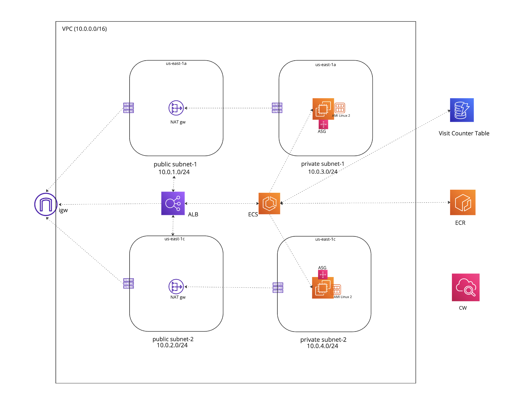

# Visit Counter Web Application

This project creates web-application that counts visits and has a button to reset the counter. 
Features of application: 
- Application is built as Docker image.
- Autoscalable.
- Stateless.

Running version of the project can be accessed from this link : http://ecsalb-1350115736.us-east-1.elb.amazonaws.com

## Service Infrasture

Project is created with listed services:

- Flask
- Docker
- AWS ECR, ECS, ALB, VPC, DynamoDB, CloudWatch
- Terraform

## Prerequisites to Run the Project 

- An AWS account and credentials configured
- AWS CLI
- Terraform 
- Docker Desktop
- Python
- Boto3

## How To Run

To deploy this project, follow the step by step instructions:

- Log into AWS account and create ECR Repository: 
aws ecr create-repository \
    --repository-name flask-docker-app \
    --image-scanning-configuration scanOnPush=true \
    --region us-east-1

- Log into ECR and run the following command: (Replace ACCOUNT_ID with your AWS Account ID)
aws ecr get-login-password --region us-east-1 | docker login --username AWS --password-stdin <ACCOUNT_ID>.dkr.ecr.us-east-1.amazonaws.com/flask-docker-app

- cd app

- Build the Docker image:
docker build --tag flask-docker-app .

- Tag the Docker image:
docker tag flask-docker-app:latest <AWS_ID>.dkr.ecr.us-east-1.amazonaws.com/flask-docker-app:latest

- Push the Docker image to ECR:
docker push <AWS_ID>.dkr.ecr.us-east-1.amazonaws.com/flask-docker-app:latest

- Copy image URI from ECR console
 
- Go to /terraform directory in project

- Run terraform commands:
terraform init
terraform plan
terraform apply 

- After running terraform apply, you will see and output "alb_dns_name". 
Copy the value and go to this address from your browser. You will see the visit counter application running. 

- To delete the project:
Run terraform destroy command and manually delete image and repository from AWS ECR console.

## Improvements

GitHub workflow file in the project can be integrated and used to push images to ECR automatically.